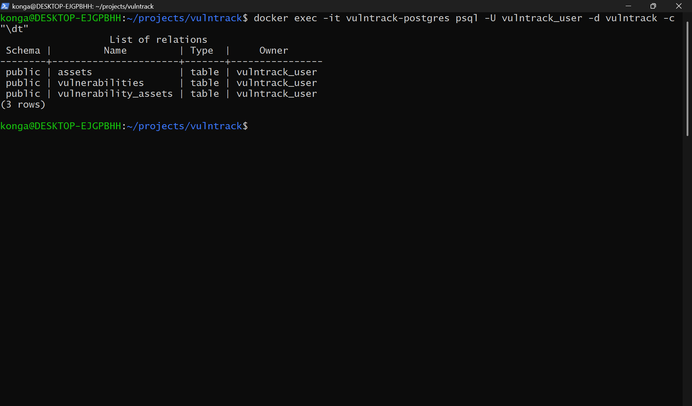
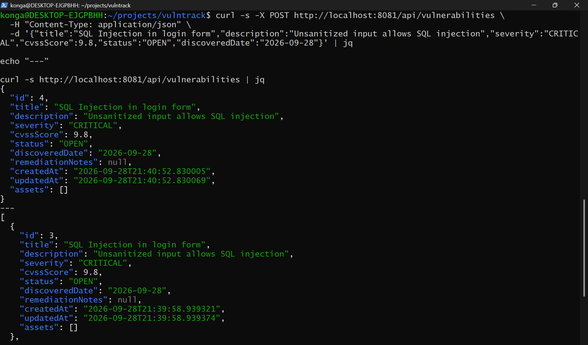
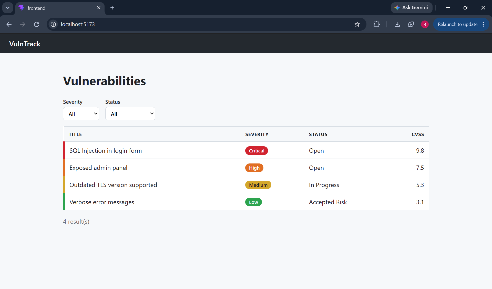
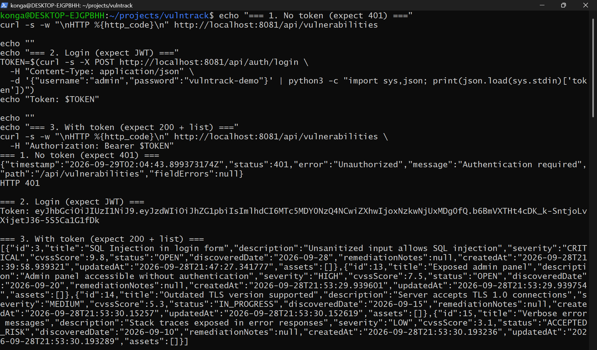
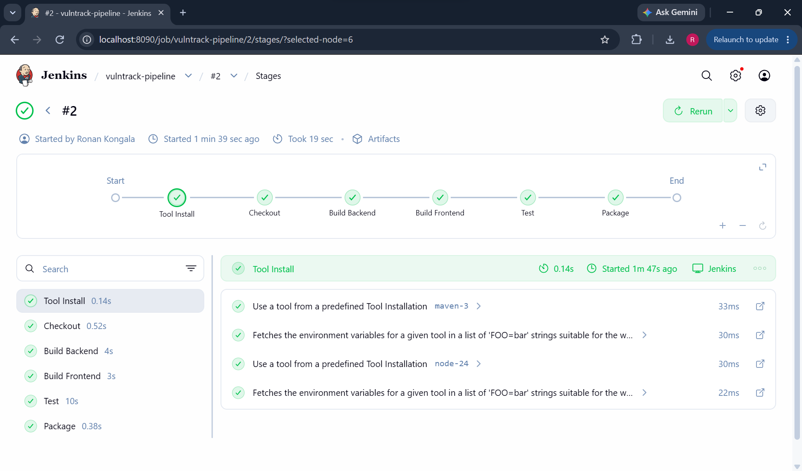
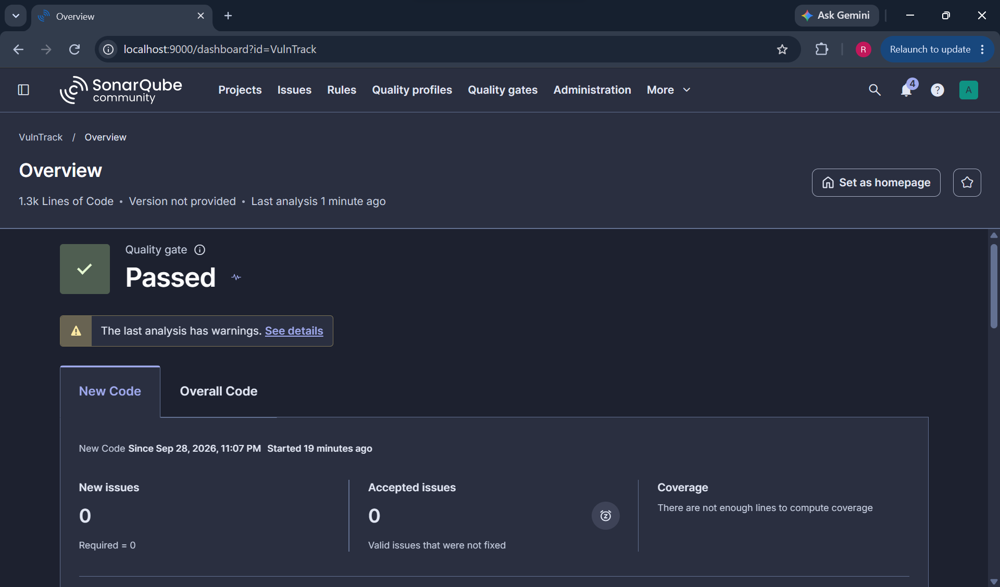
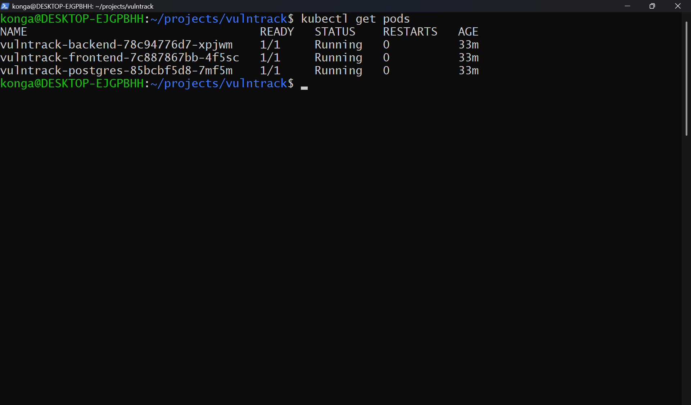
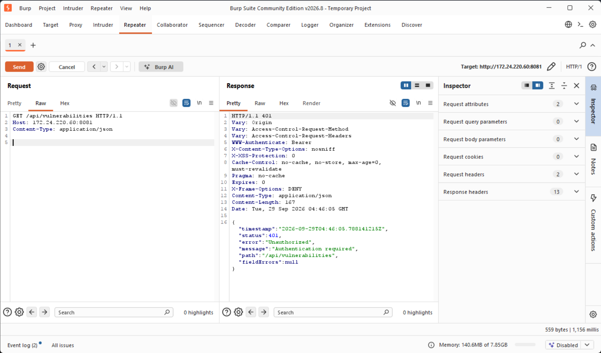

# VulnTrack

VulnTrack is a full-stack vulnerability management application for recording, triaging, and tracking security findings across assets. It pairs a Spring Boot REST API with a React single-page application backed by PostgreSQL, and wraps the application in a security-focused delivery pipeline: a Jenkins CI/CD pipeline with a SonarQube SAST quality gate, container orchestration on Kubernetes via a Helm chart, and manual dynamic application security testing (DAST) with Burp Suite.

## Features

- CRUD vulnerability tracking (create, view, update, and delete findings linked to assets)
- Severity color-coded dashboard
- Filtering by severity and status
- JWT authentication on all API endpoints
- Jenkins pipeline with a SonarQube SAST gate that blocks the build on critical issues
- Kubernetes deployment via Helm
- Manual DAST testing documented in [DAST_FINDINGS.md](DAST_FINDINGS.md)

## Architecture

The project is organized into four deliverables.

### 1. Full-Stack Application

A Spring Boot 4 (Java 21) REST API exposes vulnerability and asset resources under `/api`, with Spring Data JPA for persistence and Flyway migrations for the PostgreSQL schema. Spring Security enforces stateless JWT authentication. The React and TypeScript frontend (built with Vite) provides a login page, a color-coded dashboard with severity and status filters, and a detail view for each finding.

### 2. CI/CD Pipeline

A declarative `Jenkinsfile` runs Checkout, Build Backend, Build Frontend, Test, SonarQube Analysis, Quality Gate, and Package stages. SonarQube runs locally through `sonar-compose.yml`, and the Quality Gate stage fails the build when new blocker or critical issues are introduced.

### 3. Container Orchestration

The backend and frontend each have a Dockerfile. The frontend image serves the built SPA with nginx and proxies `/api` to the backend service. The Helm chart in `helm/vulntrack` deploys the backend, frontend, and PostgreSQL as separate Deployments with Services, a PersistentVolumeClaim for database storage, a ConfigMap for non-secret settings, and Secrets for credentials and the JWT signing key.

### 4. Dynamic Security Testing

The running application was tested manually with Burp Suite Community Edition against the OWASP Top 10, covering security headers, authentication enforcement, and SQL injection on filter parameters. Results are documented in [DAST_FINDINGS.md](DAST_FINDINGS.md).

## Tools and Frameworks

| Area | Tools | Status |
|---|---|---|
| Backend | Java 21, Spring Boot, Spring Data JPA, Spring Security | Reused |
| Frontend | React, TypeScript, Vite | Reused |
| Database | PostgreSQL 16, Flyway | Reused |
| CI/CD | Jenkins | New |
| SAST | SonarQube | New |
| Container orchestration | Kubernetes, Helm | New |
| DAST | Burp Suite Community Edition | New |
| Containerization | Docker, Docker Compose | Reused |

## Results

- CRUD API verified end to end with curl
- React dashboard functional with severity color-coding and filtering
- JWT authentication enforced on all protected endpoints
- SonarQube SAST gate caught real violations, including BLOCKER `java:S6437` (hard-coded credentials) and CRITICAL `java:S5547` (weak DES cipher), failed the build, and cleared once they were removed
- Jenkins pipeline passing with all stages green
- Kubernetes deployment running with 0 restarts across all three pods
- DAST findings documented in [DAST_FINDINGS.md](DAST_FINDINGS.md)

## Repository Structure

```
vulntrack/
├── backend/                          Spring Boot REST API (Maven)
│   ├── Dockerfile
│   └── src/main/resources/
│       └── db/migration/             Flyway SQL migrations
├── frontend/                         React + TypeScript SPA (Vite)
│   ├── Dockerfile
│   └── nginx.conf.template
├── helm/
│   └── vulntrack/                    Helm chart for Kubernetes
├── docs/
│   └── screenshots/                  Screenshots referenced below
├── Jenkinsfile                       CI/CD pipeline definition
├── sonar-compose.yml                 Local SonarQube server
├── docker-compose.yml                Local PostgreSQL for development
└── DAST_FINDINGS.md                  Burp Suite DAST results
```

## Screenshots

### PostgreSQL schema created



*Flyway migration applied, creating the VulnTrack tables in PostgreSQL.*

### Spring Boot API verified



*CRUD endpoints of the REST API exercised with curl.*

### React dashboard



*Dashboard with severity color-coding and severity and status filters.*

### Authentication enforced



*Unauthenticated requests rejected with HTTP 401; requests succeed only with a valid JWT.*

### Jenkins pipeline success



*Jenkins pipeline with every stage passing.*

### SonarQube quality gate



*SonarQube quality gate result for the backend analysis.*

### Helm deployment running



*Backend, frontend, and PostgreSQL pods running on Kubernetes with 0 restarts.*

### Burp Suite findings



*Burp Suite manual testing of the API; details in DAST_FINDINGS.md.*

## Authorization

This project was built and tested in a local lab environment. No external systems were targeted or accessed during testing.
